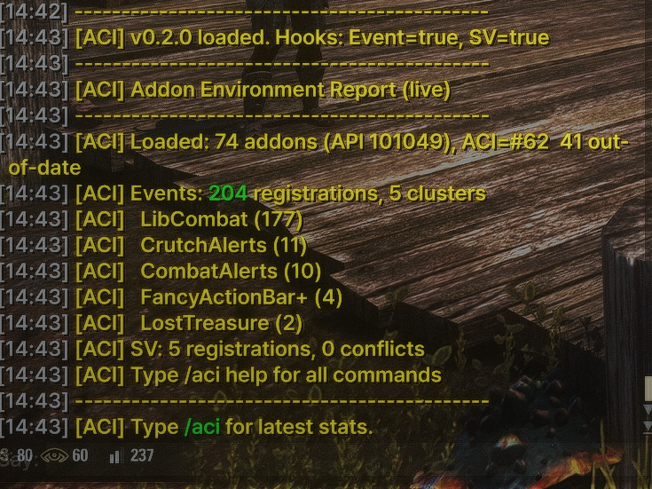
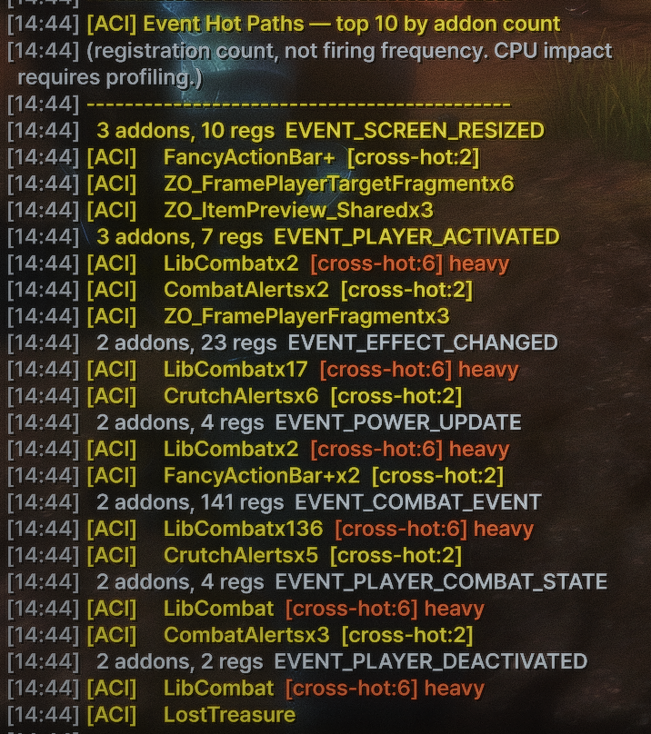
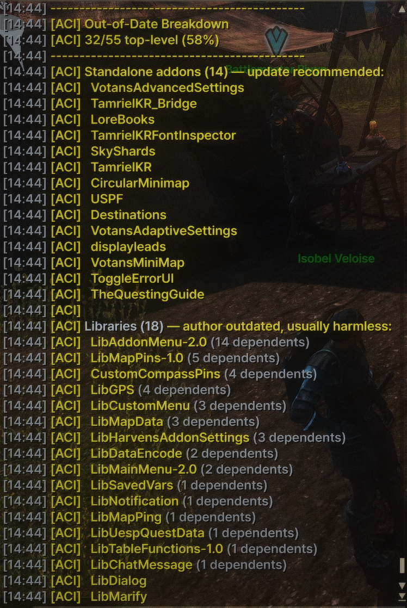

# AddOn Conflict Inspector (ACI)

**One slash command tells you what's wrong with your ESO addon environment.**

`/aci health` gives you a traffic-light diagnosis: out-of-date addons that actually need attention (vs. abandoned libraries that don't), unused libraries you can safely delete, SavedVariables conflicts, missing dependencies, and the addons hogging your disk space — all in one screen.


> **Distribution:** ACI will be published on [ESOUI](https://www.esoui.com/) as the official end-user channel. This GitHub repository is the development source — grab the packaged release from ESOUI once it's live, or build from source here.

---

## What it does

ACI is a diagnostic addon for *Elder Scrolls Online*. It hooks into the addon manager at load time and answers questions you didn't know to ask:

- **"Which of my 60 addons is actually out-of-date?"** Most "out-of-date" warnings are noise from abandoned libraries that still work fine. ACI separates them from the addons you actually need to update.
- **"Why is my SavedVariables file 4 MB?"** Disk usage ranking with `[review]`, `[unused]`, and `[deps]` tags shows you which addons are eating space and whether anything still uses them.
- **"Which addons are slowing me down?"** Event hot path analysis flags addons registered for many high-traffic events, with cross-reference annotations.
- **"Which libraries should I double-check?"** *Review candidate* list: libraries that appear inactive by manifest-level signals (not declared by any enabled addon, author marked out-of-date). ACI flags them for **manual review** — it does not tell you to delete anything. See [What ACI cannot tell you](#what-aci-cannot-tell-you).
- **"Did I typo a dependency?"** Missing dependency detection with case-mismatch, version-suffix, and Levenshtein-distance hints.

---

## Quick start

1. Download the latest release and extract `ZZZ_AddOnInspector` into your AddOns folder:
   ```
   Documents/Elder Scrolls Online/live/AddOns/ZZZ_AddOnInspector/
   ```
2. Enable it in the in-game addon menu and reload.
3. Type `/aci` for a one-screen environment summary, or `/aci health` for the diagnosis.

The `ZZZ_` prefix ensures ACI loads last, so it can observe every other addon's registrations.

---

## What you'll see

### `/aci` — environment summary

The first thing to type. Loaded addon count, current API version, out-of-date count, the top event clusters, SavedVariables registrations and conflicts.



### `/aci health` — traffic-light diagnosis

The headline command. Splits your out-of-date addons into *ignorable* (libraries, embedded sub-addons) and *attention* (standalone addons that actually need updating). If any libraries look inactive by manifest-level signals, they show up as **review candidates** with an explicit warning that the ESO Lua API cannot see runtime dependencies — verify in Minion or the addon's own documentation before touching anything.


### `/aci sv` — SavedVariables analysis

Conflicts (when two addons fight over the same SV key) plus a disk usage ranking. Tags tell you whether each big SV file is still in use:

- `[deps]` — library that other addons still declare as a dependency
- `[unused]` — library that no enabled addon declares as a dependency
- `[review]` — `[unused]` plus author-marked out-of-date. A candidate for **manual review**, not automatic deletion — see [What ACI cannot tell you](#what-aci-cannot-tell-you).


### `/aci hot` — event hot paths

Lists the events with the most addon registrations. The `[cross-hot:N]` annotation tells you how many of the top hot events a given addon appears in — a quick way to spot addons that contribute to multiple performance hot spots.



Sort by registration count instead of addon count with `/aci hot regs`.

### `/aci ood` — out-of-date breakdown

Stop panicking about the "32 out of date" warning. ACI splits OOD addons into three buckets: **standalone** (you should update these), **libraries** (author abandoned them, but they still work), and **embedded** (bundled inside another addon, ignore).



---

## All commands

| Command | What it does |
|---------|--------------|
| `/aci` | Environment summary |
| `/aci health` | Traffic-light diagnosis with review-candidate hints |
| `/aci sv` | SavedVariables registrations, conflicts, disk usage with dependency tags |
| `/aci hot` | Event hot paths sorted by addon count, with cross-hot annotations |
| `/aci hot regs` | Event hot paths sorted by registration count |
| `/aci ood` | Out-of-date breakdown (standalone / library / embedded) |
| `/aci orphans` | Unused libraries + de-facto libraries |
| `/aci missing` | Missing dependencies + 3-tier hint matching |
| `/aci deps` | Most depended-on libraries |
| `/aci deps X` | Forward and reverse dependencies for addon X |
| `/aci stats` | Event registration stats by cluster |
| `/aci addons` | Full addon list (enabled / disabled / out-of-date) |
| `/aci init` | Init time estimation (top 10) |
| `/aci save` | Force SavedVariables priority save |
| `/aci help` | Command list |

---

## What ACI cannot tell you

ACI analyzes addon dependencies using the ingame Lua API, which has significant blind spots:

- **OptionalDependsOn is invisible**: `GetAddOnDependencyInfo()` returns only `DependsOn` entries, silently dropping optional dependencies. If addon A optionally depends on addon B, ACI sees no relationship.
- **Runtime global-function use is invisible**: If addon A calls `LibSomething.Foo()` at runtime without declaring it as a dependency, ACI has no way to detect this.
- **Manifest-level only**: All analysis is based on .txt manifest files. Addons that wire themselves together through shared globals, hooks, or event subscriptions are invisible to ACI.

For these reasons, any "review candidates" output is a **starting point for manual investigation**, not a list of safe deletions. Always verify in [Minion](https://minion.mmoui.com/) or the addon's own documentation before removing anything.

---

## Languages

- **English** — default
- **한국어** — auto-enabled if [TamrielKR](https://tamrielkr.com/) is installed

ESO doesn't officially support Korean, so the standard `$(language).lua` auto-loading mechanism can't dispatch to a Korean file. ACI loads its Korean strings unconditionally and self-checks for the TamrielKR community patch with a 3-tier fallback. If you're a Korean player using TamrielKR, ACI just works.

---

## License

Source-available under a custom license. Personal, private, non-commercial use and private local modifications are allowed. Re-uploading, redistributing, repackaging, or distributing modified versions is not allowed without prior written permission.

See the [LICENSE](LICENSE) file for the full terms.

---

## For developers

<details>
<summary>Architecture and technical notes</summary>

### File layout

```
ZZZ_AddOnInspector/
  ACI_Core.lua         globals, SV init, event lifecycle, ACI.S string table + ACI.L() lookup,
                       hardcoded EVENT_* probe list, utilities
  ACI_Strings_en.lua   English default string table (~130 keys)
  ACI_Strings_kr.lua   Korean overrides, gated by 3-tier IsKoreanClient (TamrielKR-aware)
  ACI_Hooks.lua        PreHook install (RegisterForEvent, ZO_SavedVars), traceback-based caller detection
  ACI_Inventory.lua    static metadata collection via GetAddOnManager
  ACI_Analysis.lua     clustering, dependency index, OOD segmentation, SV cross-analysis,
                       hot path cross-reference, health score, typo detection
  ACI_Commands.lua     /aci slash command system
```

### Key technical notes

- **`pairs(_G)` is unsalvageable for `EVENT_*` enumeration.** ESO's global table contains a protected entry that crashes `next()` even with per-step `pcall`. Iteration order is deterministic, so you cannot skip past it. ACI uses `pcall(rawget, _G, name)` against a hardcoded ~120-entry list of well-known event names instead, which bypasses metamethods entirely. See `docs/Phase 3 Step C - rawget Probe Workaround for _G Iteration Wall.md`.
- **`d()` needs `zo_callLater`.** Chat output during `EVENT_ADD_ON_LOADED` or `EVENT_PLAYER_ACTIVATED` executes without error but the chat UI isn't ready to display. Delay with `zo_callLater(fn, 500-1000)`.
- **`/reloadui` does not reload addon code.** ESO requires a full game restart to pick up Lua file changes.
- **`OptionalDependsOn` is invisible to API.** `GetAddOnDependencyInfo()` only returns `DependsOn` entries. `OptionalDependsOn` entries are not reported. See `docs/Phase 2 Step 3 - OptionalDependsOn API Discovery.md`.
- **`ZO_SavedVars` colon vs dot call.** `ZO_PreHook` on table methods shifts arguments when the caller uses dot syntax (`ZO_SavedVars.New(...)`) vs colon syntax (`ZO_SavedVars:New(...)`). ACI handles both via `type(self)` detection.
- **`lastLoadedAddon` is unreliable after load phase.** During `PLAYER_ACTIVATED`, it's permanently the last addon (ACI itself). Both SV and event hook caller attribution use `debug.traceback` folder extraction (`user:/AddOns/(.-)/`) instead.
- **Korean is not an officially supported ESO language.** `GetCVar("language.2")` will never return `"kr"` on a stock client, so the standard `## Lua: $(language).lua` auto-load mechanism cannot dispatch to a Korean file. ACI loads `ACI_Strings_kr.lua` unconditionally and self-checks via `TamrielKR` presence and API. The TamrielKR patch hooks `GetCVar` to return `"en"` defensively, so a CVar check alone is a dead path — the real signal is the TamrielKR addon itself.

### Documentation

Development logs and design documents are in the `docs/` folder, organized by phase:

- **Phase 0** — Proof of concept, SV data analysis
- **Phase 1** — Full architecture, inventory, analysis, health score, commands
- **Phase 2** *(complete)* — Technical debt cleanup, missing dep detection, typo hints, OOD segmentation, review-candidate heuristic, SV disk cross-analysis, traceback-based SV caller detection, conflict validation
- **Phase 3** *(complete)* — Event hook traceback (full caller attribution for `RegisterForEvent`), hot path × cross-reference matrix, `rawget` probe workaround for the `pairs(_G)` iteration wall, English/Korean i18n with `TamrielKR`-aware detection

</details>

---

*This add-on is not created by, affiliated with, or sponsored by ZeniMax Media Inc. or its affiliates. The Elder Scrolls is a registered trademark of ZeniMax Media Inc.*
